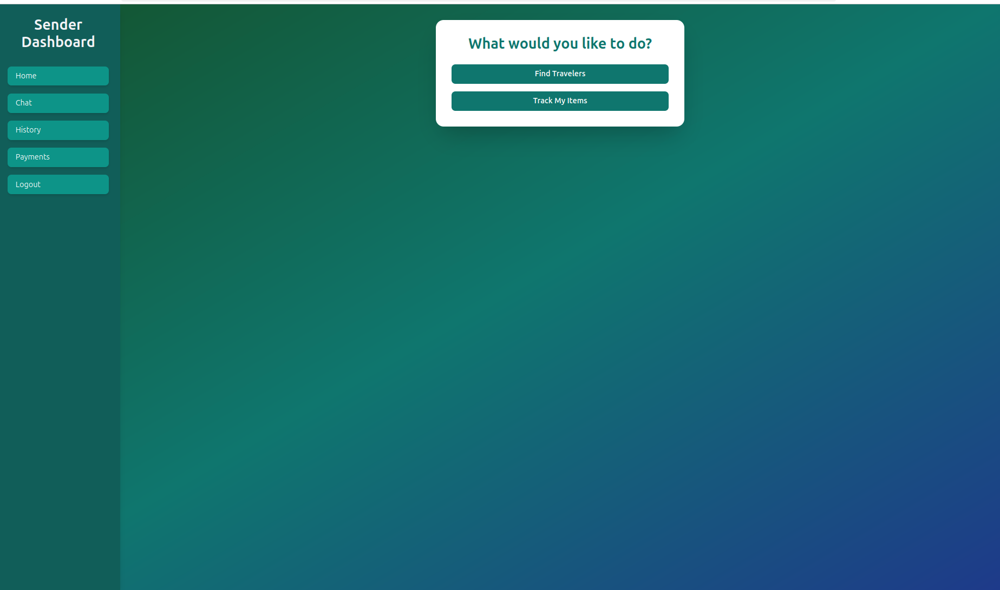
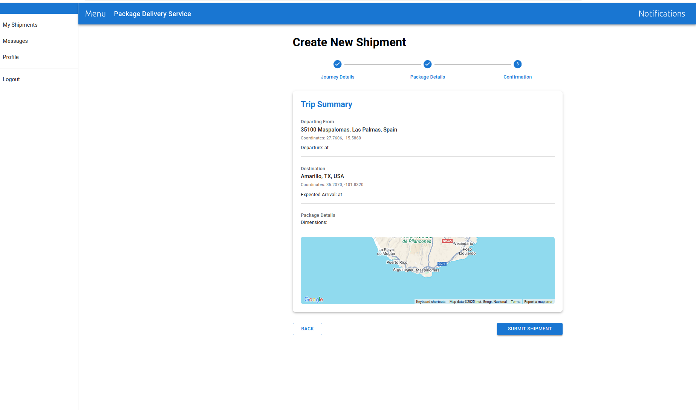
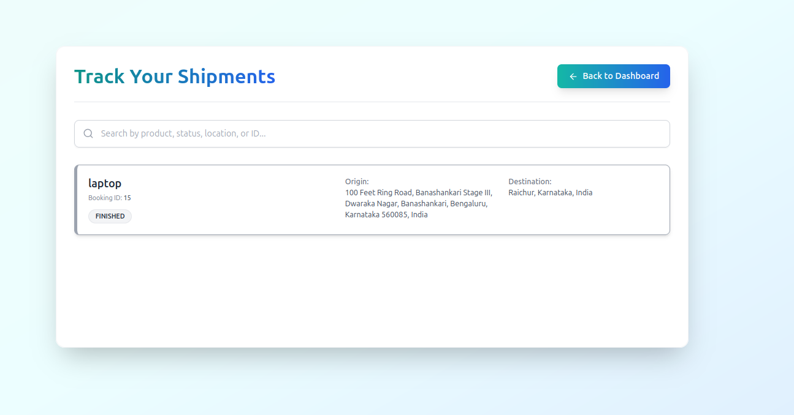
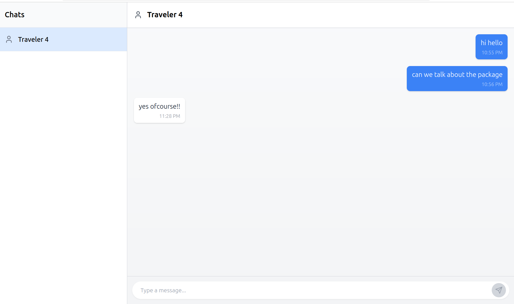

# Deliver While You Travel

Deliver While You Travel is a platform that connects travelers with senders who need to transport small packages. Travelers can post their travel details, and senders can search for suitable travelers based on the source and destination. The platform aims to provide a cost-effective and efficient alternative to traditional courier services.

---

## Screenshots

Here are some glimpses of the application interface:

**Main Interface:**


**Sender View:**


**Traveler View:**


**Shipment Tracking:**
 
*(Note: Ensure the filename is exactly `track_my_shpipmets.png` if there's a typo)*

**Chat Interface (Planned/Actual):**



---

## Technologies Used
- **Frontend**: React
- **Backend**: Spring Boot (Java)
- **Database**: SQL Database (e.g., MySQL, PostgreSQL, H2 - specify yours if known)
- **Build Tool (Backend)**: Maven
- **Package Manager (Frontend)**: npm
- **Deployment**: [Specify if applicable, e.g., Docker, AWS, Heroku]
- **Additional Tools**: [Specify if applicable, e.g., JWT for authentication, Lombok]

---

## Key Features
- **User Registration and Profile Management**:
  - Register as a traveler or sender.
  - Update profiles with Aadhar and photo.
- **Travel Post and Search**:
  - Travelers can post their travel details.
  - Senders can search for nearby travelers.
- **Booking and Payment**:
  - Book a traveler for package delivery.
  - Secure payment system integrated.
- **Traveler-Sender Interaction**:
  - View bookings and delivery history.
  - (Chat feature planned but not yet implemented.)

---

## Architecture and Design
- **Architecture Pattern**: Likely MVC (Model-View-Controller) for Spring Boot backend.
- **Design Principles**: [e.g., SOLID principles, Dependency Injection via Spring]
- **Design Patterns**: [e.g., Repository Pattern (Spring Data JPA), Singleton (Spring Beans)]

---

## Use Cases
1. User Registration and Login
2. Profile Update with Aadhar and Photo
3. Post Travel Details
4. Search for Travelers by Source and Destination
5. Book a Traveler for Delivery
6. Make Payments for Bookings

---

## Folder Structure

The main repository contains the following key directories:

-   **/demo**: Contains the Spring Boot backend codebase.
    -   `src/main/java`: Java source files (controllers, services, repositories, models).
    -   `src/main/resources`: Configuration files (`application.properties` or `application.yml`), static assets, templates.
    -   `pom.xml`: Maven project build configuration.
-   **/project**: Contains the React frontend codebase.
    -   `src`: React components, hooks, services, styles.
    -   `public`: Static assets like `index.html`.
    -   `package.json`: Project dependencies and scripts (uses npm).
-   **/[Other Folders]**: [e.g., Database scripts, Docker files, documentation]
-   *(Image files like `front.png`, `sender.png`, etc. are also in the root)*

---

## Setup and Running Instructions

Follow these steps to set up and run the project locally. You will need Java (JDK), Maven, Node.js, and npm installed.

**1. Clone the Repository:**
    ```bash
    git clone https://github.com/Imbasava/Deliver-While-You-Commute.git
    cd Deliver-While-You-Commute
    ```


**2. Configure Backend (`demo` folder):**

   a. Navigate to the backend directory:
      ```bash
      cd demo
      ```
   b. **Database Setup:**
      - Make sure your SQL database server (e.g., MySQL, PostgreSQL) is running.
      - Create a database for the application (e.g., `deliver_while_you_travel_db`).
      - Configure the database connection details (URL, username, password) in `src/main/resources/application.properties` (or `application.yml`). Look for properties like `spring.datasource.url`, `spring.datasource.username`, `spring.datasource.password`.
   c. **Install Backend Dependencies (handled by Maven):**
      ```bash
      mvn clean install
      ```
      *(This step downloads dependencies defined in `pom.xml` and builds the project)*

**3. Run the Backend Server:**

   a. **Make sure you are still inside the `demo` directory.**
   b. Run the Spring Boot application using Maven:
      ```bash
      mvn spring-boot:run
      ```
   c. The backend server should start, typically on `http://localhost:8080` (check console output for the exact port). Keep this terminal running.

**4. Configure Frontend (`project` folder):**

   a. Open a **new terminal window/tab**.
   b. Navigate back to the main project directory (`Deliver-While-You-Commute`) if you aren't already there.
      ```bash
      # If you are still in the 'demo' directory:
      cd ..
      # Now navigate into the 'project' directory
      cd project
      ```
      *Alternatively, if you are in the root `Deliver-While-You-Commute` directory already in the new terminal:*
      ```bash
      cd project
      ```
   c. **Install Frontend Dependencies using npm:**
      ```bash
      npm install
      ```
   d. **API Configuration (if needed):** Check if the frontend code (e.g., in a `.env` file, `src/config.js`, or directly where API calls are made) needs configuration to point to the backend API URL (e.g., `http://localhost:8080`). Ensure it matches the running backend server address.

**5. Run the Frontend Development Server:**

   a. **Make sure you are still inside the `project` directory.**
   b. Start the React development server using the `dev` script (defined in `package.json`):
      ```bash
      npm run dev
      ```
   c. This will usually open the application automatically in your web browser at `http://localhost:3000` (or another port, often `http://localhost:5173` if using Vite - check the console output). Keep this terminal running.

**6. Access the Application:**

   - Open your web browser and navigate to the frontend URL provided in the terminal output after running `npm run dev` (e.g., `http://localhost:3000` or `http://localhost:5173`).
   - The React frontend will communicate with the Spring Boot backend running on its port (e.g., `localhost:8080`).

---

## How to Contribute
1. Fork the repository.
2. Create a new feature branch: `git checkout -b feature/your-feature-name`.
3. Make your changes in the relevant folders (`demo` for backend, `project` for frontend).
4. Commit your changes: `git commit -m "Add your concise commit message here"`.
5. Push to the branch: `git push origin feature/your-feature-name`.
6. Open a Pull Request against the `main` branch of the original repository.

---

## License
[Specify your license here, e.g., MIT License. If you choose one, add a LICENSE file to the repository root.]

---

## Contact
For any questions or support, please contact:
- Basavaraj
- bbasavarajnayak64@gmail.com
-  Repository Link: https://github.com/Imbasava/Deliver-While-You-Commute
